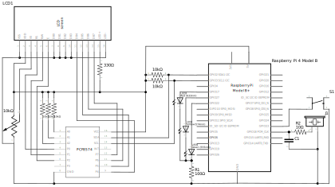
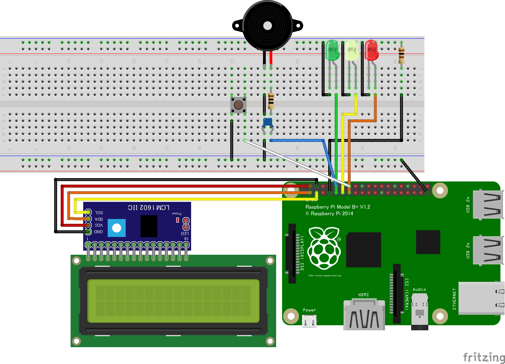

# Suricata Alert Notice App

This is an application that sends notifications via email or LINE (or both) when Suricata generates an alert. It also includes optional features like LCD display, indicator LED display, and buzzer alert.

## Prerequisites
- This application reads the `eve.json` output by Suricata, so make sure you configure Suricata to generate the output.
- The LCD display is done using I2C. To work with it, install the `smbus2` library using pip:
  ```
  pip install smbus2
  ```
- Apart from `smbus2`, the application utilizes standard Python packages. If any of these are not installed, please install them as needed.

## Hardware
- Raspberry Pi 4 Model B x1
- 1602 LCD with I2C I/O expander (PCF8574) x1
- Tactile switch S1 x1
- LED: Green LED1 x1, Yellow LED2 x1, Red LED3 x1
- Piezo buzzer (self-driven) J1 x1
- 100Ω resistor R1 x1
- 10Ω resistor R2 x1
- 0.33μF capacitor C1 x1
- Suitable board or breadboard x1
- Wires or jumper wires

### Circuit Diagram
The wiring of the LCD and PCF8574 is provided for reference...


### Physical Wiring Diagram


## Setup
### 1. Specify GPIO Pins
- Piezo buzzer GPIO pin specification
  ```python
  # bz_control.py
  BZ_PIN: int = 18
  ```

- LED GPIO pin specification
  ```python
  # led_control.py
  GREEN_LED_PIN: int = 17
  YELLOW_LED_PIN: int = 27
  RED_LED_PIN: int = 22
  ```

- Stop switch GPIO pin specification
  ```python
  # main.py
  STOP_SW_PIN: int = 23
  ```

- Specify I2C address
  1. Enable I2C using sudo raspi-config. (Details omitted)
  2. Install the I2C tools package i2c-tools using apt:
  3. Execute the following command to identify available I2C buses. Use bus number 1 for I2C communication.
      ```
      $ i2cdetect -l
      i2c-20  i2c             fef04500.i2c                            I2C adapter
      i2c-1   i2c             bcm2835 (i2c@7e804000)                  I2C adapter <- This one
      i2c-21  i2c             fef09500.i2c                            I2C adapter
      ```
  4. Use the following command to identify connected devices' addresses. In this case, the address is 0x27.
      ```
      $ i2cdetect -y 1
          0  1  2  3  4  5  6  7  8  9  a  b  c  d  e  f
      00:                         -- -- -- -- -- -- -- -- 
      10: -- -- -- -- -- -- -- -- -- -- -- -- -- -- -- -- 
      20: -- -- -- -- -- -- -- 27 -- -- -- -- -- -- -- -- 
      30: -- -- -- -- -- -- -- -- -- -- -- -- -- -- -- -- 
      40: -- -- -- -- -- -- -- -- -- -- -- -- -- -- -- -- 
      50: -- -- -- -- -- -- -- -- -- -- -- -- -- -- -- -- 
      60: -- -- -- -- -- -- -- -- -- -- -- -- -- -- -- -- 
      70: -- -- -- -- -- -- -- --                         
      ```
  5. Specify the address you found in step 4 as I2C_ADDR in i2c_control.py.
      ```python
      # i2c_control.py
      I2C_ADDR = 0x27
      ```
  6. (options) Depending on the LCD you are using, you might need to change other defined values as well. Please refer to the datasheet and adjust the values accordingly.

### 2. Configure config/notice.py
Configure the email server authentication and LINE Notify token for sending messages. Note that the details of LINE Notify configuration are not provided here.
```python
# config/notice.py
SENDER_EMAIL: str = "your_email@example.com"  # Sender's email address
RECEIVER_EMAIL: str = "your_email@gmail.com"  # Recipient's email address
SMTP_SERVER: str = "smtp.gmail.com"           # SMTP server hostname (Using Gmail in this case)
SMTP_PORT: int = 587                          # SMTP server port
SMTP_USER: str = "your_email@gmail.com"       # SMTP server authentication username
SMTP_PASS: str = "**********************"     # SMTP server authentication password

LINE_NOTIFY_TOKEN: str = "***************************" # Line Notify API Access Token
```

### 3. Configure config/general.py
Configure notification settings, target signature IDs, and other settings.
```python
# config/general.py
from enum import Enum

class NoticeType(Enum):
    Nothing = 0     # No notification (only LCD display)
    Email = 1       # Email notification
    LineNotify = 2  # LINE notification
    Both = 3        # Email & LINE notification

EVE_JSONL_PATH: str = "/usr/local/var/log/suricata/eve.json" # Path to eve.json
NOTICE_TYPE = NoticeType.Email  # Notification settings
# Notify only for signatures within SIGNATURE_ID_RANGE
SIGNATURE_ID_RANGE: tuple[int, int] = (2000000, 2099999) # ET Open Rulesets
# If PRIORITY_SIG_CATEGORY is present in signature message, activate the buzzer
PRIORITY_SIG_CATEGORY: list[str] = [
        "Attack Response", "DNS", "DOS", "Exploit", "FTP", 
        "ICMP", "IMAP", "Malware", "NETBIOS", "Phishing", 
        "POP3", "RPC", "Shellcode", "SMTP", "SNMP", "SQL", 
        "TELNET", "TFTP", "Web Client", "Web Server", "Web Specific Apps", "WORM"
    ] # Categories like "ET xxx" (e.g., "ET Exploit ~")
```

In my case, I configured the application to notify only for alerts with signature IDs in the range of 2000000 ~ 2099999 from the Emerging Threats open ruleset.
Also, any signature message containing a string from `PRIORITY_SIG_CATEGORY` will be treated as a high-level alert, triggering the buzzer and activating the red LED.